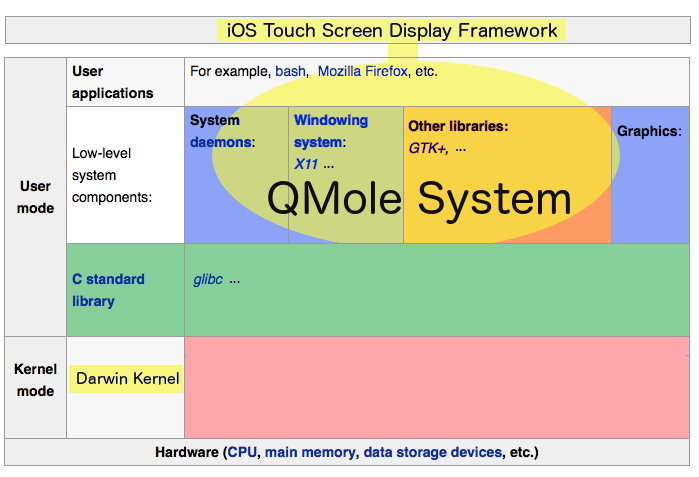

# GNU Linux Desktop System for IPhone &amp; IPad

[See also: QMole Cydia Reposity on Github](https://github.com/chriskmanx/qmole-packages)

[See also: iPyhton Notebook on iPhone](https://chriskohlhepp.wordpress.com/linux-on-iphone/ipython-notebook-on-iphone/)

[See also: QMole Linux Desktop Manual](https://chriskohlhepp.wordpress.com/linux-on-iphone/qmole-linux-desktop-for-ios-manual/)

## What is Qmole?

1) It’s a "Smart Routing Tiling Window Manager" for touch screen tablets and smart phones.

[Linux Applications on iPhone](https://chriskohlhepp.wordpress.com/linux-on-iphone/)

That’s kind of a world’s first !

2) It’s a compatibility container

QMole allows iPhones and iPads to run graphical Linux applications. It enables touch-screen operation of Linux applications executing together with native iOS applications on a self contained Linux style desktop. This desktop introduces automatic window management for the touch screen and enables full access to the data on your device.

## QMole Architecture

QMole is a hybrid. It is not a virtualization solution like VMWare or VirtualBox. Neither is it an operating system. It requires no new API of application developers, as does iOS. QMole sandwiches applications in standard Linux abstraction on one side and provides touch screen abstractions and window management on the other side. This provides re-usability of Linux applications. In architectural terms, QMole occupies a space somewhere between BSD and Linux, but based on the Darwin kernel.

QMole uses the excellent [Herbstluft Window Manager](https://www.herbstluftwm.org). The window managers [Fluxbox](http://fluxbox.org), [i3](https://i3wm.org), and [Awesome](https://awesomewm.org) are also supported. 

QMole is designed and authored by [Chris Kohlhepp](https://chriskohlhepp.wordpress.com) - [LinkedIn Profile](https://www.linkedin.com/in/chriskohlhepp/) and licensed open-source under the GNU GENERAL PUBLIC LICENSE. A special mention goes to Florian Engel of Cologne, Germany, for being the maintainer and scribe of QMole for the last year and a half. Thank you Florian. Thank you also to our beta testers Kyle Serbov,  Jimmy Huy & Tejas Desai.

## Manifest

### QMOLEDEV

Primary source repository of *ported* applications, all built in-place on a first generation iPad. Configure and build scripts have been modified to work around peculiarities of iOS, such as needing signed binaries to prevent the kernel from killing off intermediate executables produced during configuration or compilation. This means no cross build system, e.g. Linux or Mac OSX is needed here. These are 32 bit builds. According to the code counter [CLOC](http://cloc.sourceforge.net), there are approximately *40 million lines of mostly C and C++ code* contained in this repository.

### QMOLEDEV64

Secondary source repository of *ported* systems, all built in-pace on an iPhone 5S. These are 64 bit builds. Primary application focus is a Swiss Army Knife of network tools that turns your iphone into a Wifi hotspot security tool. You will find network capture tcpdump, nmap and snort tools here. According to the code counter [CLOC](http://cloc.sourceforge.net), there are approximately *800,000 lines of mostly C, C++ and BASH code* contained in this repository.

### XORG0 XORG1 XORG2

Primary source repositories of *ported* X11 (Unix Windowing) systems. According to the code counter [CLOC](http://cloc.sourceforge.net), there are approximately 1.9 million lines of mostly C and C++ code contained in these repositories.

### qmole-msg
### qmole-probe
### qmolegui
### qmoledevice

This is the core of the QMole system itself, written predominantly in Objective-C and OCaml.  According to the code counter [CLOC](http://cloc.sourceforge.net), there are approximately *2000 lines of Objective-C and OCaml* contained in these repositories. Objective-C accommodates the front-end of the system. The 400 lines of OCaml comprise the back-end of the system.

### scripts

Various helper and build scripts to assist with building the REPO

### 1qmole-screenshots

Screenshots showing QMole capabilities

### 2cydia-screenshots

Screenshots showing QMole installation via Cydia

## Licence Disclaimer

QMole is hereby released open-source under the GPL. Previous releases were licensed closed-source QMole UK (this continues to apply to the existing binaries up to and including beta version 0.7). The reason for the closed-source release is that QMole has dependencies on screen viewer libraries which themselves are closed-source and licensed content. Adopters have 3 main choices:

1. Also license the screen viewer libraries; please contact [ABTO Software](http://remote-screen.com)
2. Adapt the GPL licence compatible [Google Code VNSea](https://code.google.com/archive/p/vnsea/)
3. Use RealVNC's viewer on the Apple APP Store directly; please refer to [VNC Viewer](https://itunes.apple.com/us/app/vnc-viewer/id352019548?mt=8)

Each approach as its merits. *The existing implementation is optimized for use with QMole including swipe control overlays (the scroll ribbon) and fine-tuned mouse control that make standard X11 Linux applications readily usable on a touch screen with limited screen real estate.* Google Code's VNSea has the benefit of being open source, but will need adapting for use with QMole. RealVNC's viewer is a turn-key solution, but will need to be separately launched as it cannot be directly integrated with QMole. All three merely need to form loopback connections to the local device, so are never used as "remote" viewers. Please refer to [QMole Linux Desktop Manual](https://chriskohlhepp.wordpress.com/linux-on-iphone/qmole-linux-desktop-for-ios-manual/) for notes on QMole's touch screen optimization.

If you require different licence terms, feel free to get in touch with me. 

## iOS Compatibility Notes

The last version of iOS for which I maintained QMole was iOS 8. Apple has changed binary formats a number of times since the initial release of iOS, moving from 32 bit to 64 bit formats in the process. The latest version of iOS requires a rebuild of the current sources but is otherwise expected to work in full. A "rooted" device is required in all cases.

## Android Compatibility Notes

It is expected that QMole would function on Android devices after appropriate recompilation of the sources. Packages like [Termux](https://termux.com) and [GNURoot](https://play.google.com/store/apps/details?id=champion.gnuroot&hl=en) are expected to be usable with QMole - even without "rooting" the device.

## A Complex System

QMole comprises some *42 million* lines of ported and original code. Most of the core components are written in either Objective-C or OCaml, with OCaml solutions rarely beyond a few hundred lines of code. Most of the ported Unix code is C and C++. QMole has been built "on device," either on iPhone or iPad.

## Happy Hacking!

